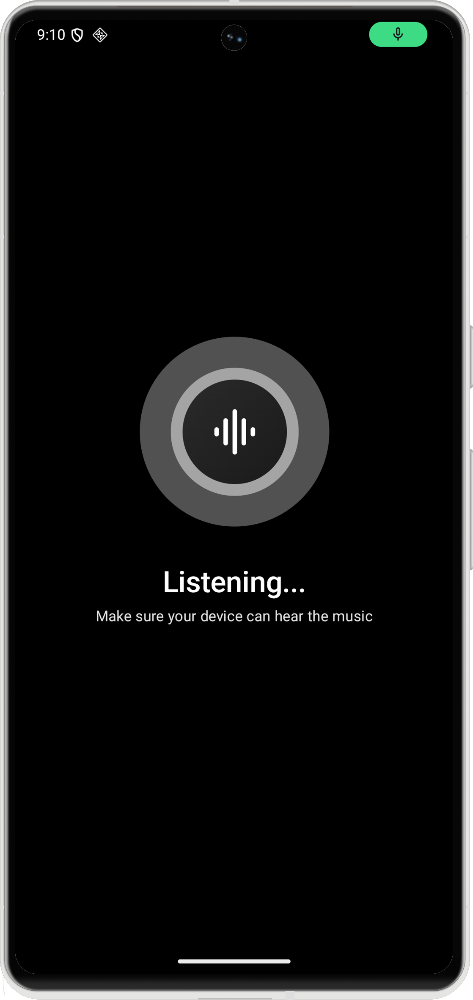

<div align="center">
  

  <h1>Echo Music</h1>

  <p><strong>A robust, open-source music streaming client offering an ad-free experience, offline capabilities, and advanced music discovery.</strong></p>

  <a href="https://trendshift.io/repositories/15844" target="_blank">
    
  </a>

<br>

  <a href="https://echomusic.fun/download">
    
  </a>
  &nbsp;
  <a href="https://echomusic.fun/obtainium">
    
  </a>
</div>

---

## Overview

Echo Music delivers a seamless, premium listening experience by leveraging YouTube Music's vast library — without the ads. It adds powerful extras including offline downloads, real-time synchronized lyrics, and environment-aware music recognition.

---

## Screenshots

<div align="center">
  
  
  
  
  
</div>

---

## Features

### Streaming & Playback
- **Ad-Free** — Stream without interruptions.
- **Seamless Playback** — Switch effortlessly between audio-only and video modes.
- **Background Playback** — Listen while using other apps or with the screen off.
- **Offline Mode** — Download tracks, albums, and playlists via a dedicated download manager.

### Discovery & Echo Find
- **Echo Find** — Identify songs playing around you using advanced audio recognition.
- **Smart Recommendations** — Personalized suggestions based on your listening history.
- **Comprehensive Browsing** — Explore Charts, Podcasts, Moods, and Genres.

### Advanced Capabilities
- **Synchronized Lyrics** — Real-time synced lyrics with AI-powered multilingual translation.
- **Sleep Timer** — Set automatic playback stop after a chosen duration.
- **Cross-Device Support** — Cast to Chromecast devices or stream via DLNA/UPnP.
- **Data Import** — Import playlists and library data from other services.

---

## Installation

### Android
Download the latest APK from the [Releases Page](https://github.com/iad1tya/Echo-Music/releases/latest).

### Build from Source

1. **Clone the repository**
   ```bash
   git clone https://github.com/iad1tya/Echo-Music.git
   cd Echo-Music
   ```

2. **Configure Android SDK**
   ```bash
   echo "sdk.dir=/path/to/your/android/sdk" > local.properties
   ```

3. **Firebase configuration**
   Firebase is required for analytics and reliable imports. See [FIREBASE_SETUP.md](FIREBASE_SETUP.md) for instructions on adding your `google-services.json`.

4. **Build**
   ```bash
   ./gradlew assembleFossDebug
   ```

---

## Community & Support

Join the community for updates, discussions, and help.

<div align="center">
  <a href="https://discord.gg/EcfV3AxH5c"></a>
  &nbsp;
  <a href="https://t.me/EchoMusicApp"></a>
</div>

---

## Support the Project

If Echo Music has been useful to you, consider supporting its development.

<div align="center">
  <a href="https://buymeacoffee.com/iad1tya"></a>
  &nbsp;
  <a href="https://intradeus.github.io/http-protocol-redirector/?r=upi://pay?pa=iad1tya@upi&pn=Aditya%20Yadav&am=&tn=Thank%20You"></a>
  &nbsp;
  <a href="https://www.patreon.com/cw/iad1tya"></a>
</div>

### Cryptocurrency

| Network | Address |
|---------|---------|
| **Bitcoin** | `bc1qcvyr7eekha8uytmffcvgzf4h7xy7shqzke35fy` |
| **Ethereum** | `0x51bc91022E2dCef9974D5db2A0e22d57B360e700` |
| **Solana** | `9wjca3EQnEiqzqgy7N5iqS1JGXJiknMQv6zHgL96t94S` |

---

## Special Thanks

Echo Music stands on the shoulders of several excellent open-source projects. Sincere thanks to:

| Project | Description |
|---------|-------------|
| [Metrolist](https://github.com/MetrolistGroup/Metrolist) | Foundational inspiration and architecture reference |
| [Better Lyrics](https://better-lyrics.boidu.dev/) | Lyrics enhancement and synchronization |
| [SimpMusic](https://github.com/maxrave-dev/SimpMusic) | Lyrics implementation reference |
| [Music Recognizer](https://github.com/aleksey-saenko/MusicRecognizer) | Audio recognition (Echo Find) |

---

## Star History

[](https://www.star-history.com/#EchoMusicApp/Echo-Music&type=timeline&legend=top-left)

---

<div align="center">
  Licensed under <a href="LICENSE">GPL-3.0</a>
</div>
