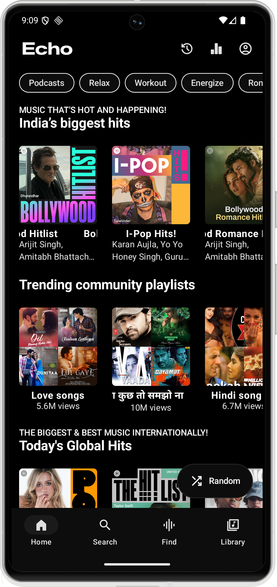
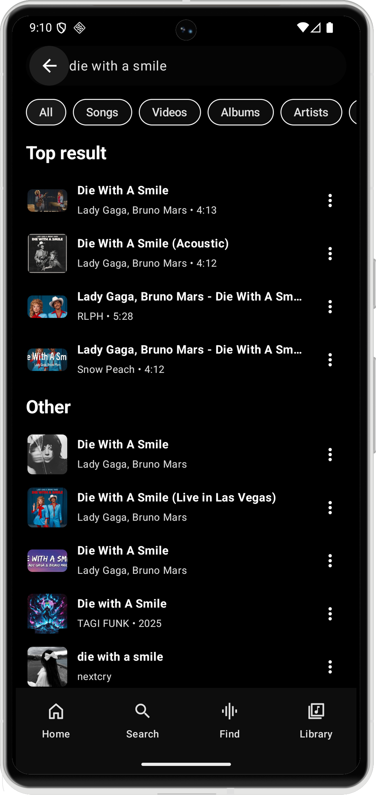
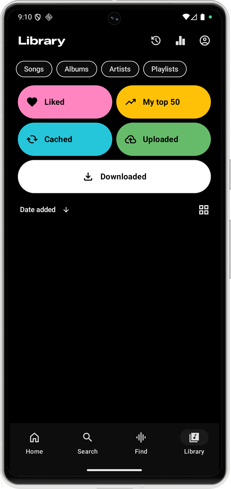
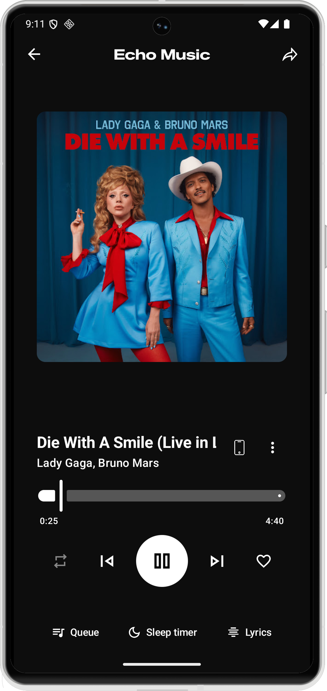

<div align="center">
  
  <h1>Echo Music</h1>
  <p><strong>A robust, open-source music streaming client offering an ad-free experience, offline capabilities, and advanced music discovery.</strong></p>

  <a href="https://echomusic.fun/download"></a>
  <br>
  <a href="https://github.com/iad1tya/Echo-Music/releases"></a>
  <a href="https://echomusic.fun/obtainium"></a>
</div>

---

## Overview

Echo Music is designed to provide a seamless and premium music listening experience. It leverages the vast library of YouTube Music while eliminating advertisements and adding powerful features such as offline downloads, real-time lyrics, and environment-aware music recognition.

## Screenshots

<div align="center">
  
  
  
  
  
</div>

## Features

### Streaming and Playback
*   **Ad-Free Experience:** Stream music without interruptions from advertisements.
*   **seamless Playback:** Switch effortlessly between audio-only and video modes.
*   **Background Playback:** Continue listening while using other applications or when the screen is off.
*   **Offline Mode:** Download tracks, albums, and playlists for offline listening with a dedicated download manager.

### Discovery and Echo Find
*   **Echo Find:** Identify songs playing in your surroundings instantly using advanced audio recognition.
*   **Smart Recommendations:** Receive personalized song suggestions based on your listening history and preferences.
*   **Comprehensive Browsing:** Explore Charts, Podcasts, Moods, and Genres to discover new music.

### Advanced Capabilities
*   **Synchronized Lyrics:** View real-time synced lyrics. Includes AI-powered translation for multilingual support.
*   **Sleep Timer:** Configure automatic playback cessation after a specified duration.
*   **Cross-Device Support:** Cast content to Chromecast-enabled devices or stream via DLNA/UPnP to compatible network speakers and TVs.
*   **Data Import:** Import playlists and library data from other services.

---

## Installation

### Option 1: Direct Download (APK)
Download the latest Android Package Kit (APK) from the [Releases Page](https://github.com/iad1tya/Echo-Music/releases/latest).

### Option 2: Build from Source
To build the application locally, follow these steps:

1.  **Clone the Repository**
    ```bash
    git clone https://github.com/iad1tya/Echo-Music.git
    cd Echo-Music
    ```

2.  **Configure Android SDK**
    Create a `local.properties` file and define your SDK path:
    ```bash
    echo "sdk.dir=/path/to/your/android/sdk" > local.properties
    ```

3.  **Firebase Configuration**
    Firebase setup is required for analytics and reliable imports. Please refer to [FIREBASE_SETUP.md](FIREBASE_SETUP.md) for detailed instructions on adding your `google-services.json`.

4.  **Build**
    Execute the Gradle build command:
    ```bash
    ./gradlew assembleFossDebug
    ```

---

## Community and Support

Join our community for updates, support, and discussions.

<div align="center">
  <a href="https://discord.gg/EcfV3AxH5c"></a>
  <a href="https://t.me/EchoMusicApp"></a>
</div>

### Support the Project

If you find this project useful, consider supporting its development.

<div align="center">
  <a href="https://buymeacoffee.com/iad1tya"></a>
  <a href="https://intradeus.github.io/http-protocol-redirector/?r=upi://pay?pa=iad1tya@upi&pn=Aditya%20Yadav&am=&tn=Thank%20You"></a>
  <a href="https://www.patreon.com/cw/iad1tya"></a>
</div>

### Cryptocurrency Addresses
<div align="center">
  <table>
    <tr>
      <td align="center"><strong>Bitcoin</strong><br><code>bc1qcvyr7eekha8uytmffcvgzf4h7xy7shqzke35fy</code></td>
      <td align="center"><strong>Ethereum</strong><br><code>0x51bc91022E2dCef9974D5db2A0e22d57B360e700</code></td>
      <td align="center"><strong>Solana</strong><br><code>9wjca3EQnEiqzqgy7N5iqS1JGXJiknMQv6zHgL96t94S</code></td>
    </tr>
  </table>
</div>


---

<div align="center">
    Licensed under <a href="LICENSE">GPL-3.0</a>
</div>
